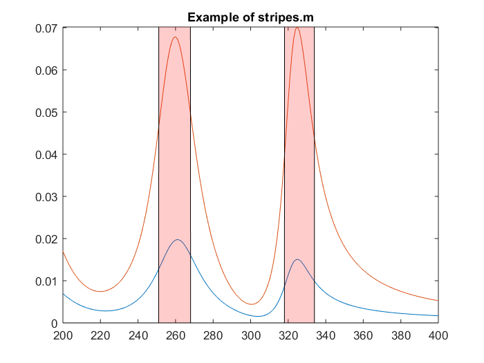
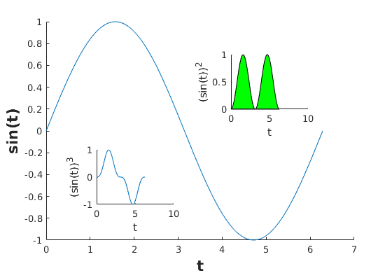

# ADRITOOLS  :wrench: :hammer: 
Useful and convenient functions for the everyday use of Matlab

* **allscreen.m:**  
*Pops-up a matlab figure the size of the current screen (or close to).* 

* **decimator.m:**  
*Self-explainatory.* 

* **ex.m:**  
*Extracts the images from a subplot-based figure.* 

* **figure_function.m:**  
*Prints figure as .pdf without the annoying extra white space.*

* **frequencylog.m:**  
*Plots FFT of signal on a log scale. Also available without the log scale as frequency.m*

* **mtit.m:**  
*Plots a title in between axes.* 

* **printing.m:**  
*Prints the current opened figure on .eps, .fig and .pdf formats. Makes use of figure_function.m* 

* **printing_image.m:**  
*Prints the current opened figure on .eps, .fig , .pdf and .png formats. Makes use of figure_function.m* 

* **inserter.m:**  
*Self-explainatory. Complementary and opposite to decimator.* 

* **outlier.m:**  
*Finds outliers on skewed distributions. Requires tuning depending on data.*

* **xo.m:**  
*Gives an error on purpose. Used to stop the code at desired locations.* 

* **im.m:**  
*Generates an image, with colorbar and colormap. Used for faster visualization of matrices.* 

* **boxplotnout.m:**  
*A normal boxplot that makes outliers invisible.* 

* **shadedErrorBar.m:**  
*Self-explainatory.* 

* **stripes.m:**  
*Takes a binary vector to plot trasparent stripes on a plot.* 

    

* **progress_bar.m:**  
*Progress bar to keep track of For iterations.*

    

* **Plot_in_Plot.m:**  
*Template code indicating how to plot a graph inside another one.* 

    
